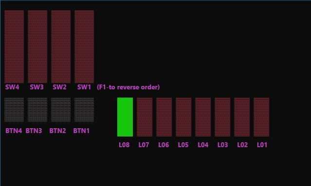

# Arduino uc32 Basic UI Shield Simulator

> Due to poor code architecture and lack of tests this project is not going to be maintained, but it could still provide itself useful for educational purpose. Feel free to clone it and expand it yourself if you like the idea.

The aim of this project is to help students who are learning Arduino, but unfortunately don't have money or are unable to find the hardware to learn on at home. With this simulator students can learn logic required for working with pins, switches, buttons and tasks. Output/Input/Loop are three separate detached tasks using logic which prevents common concurrent problems such as Data Race or Deadlock. This enables real-time response, which makes working with simulator feel like working with the real thing.

## Table of Contents

- [Installation](#installation)
- [Usage](#usage)
  - [Controls](#Controls)
- [API Reference](#API-Reference)
  - [Commands](#Commands)
  - [Tasks](#Taks)
- [Support](#Support)
- [License](#License)

## Installation

- [DOWNLOAD](https://github.com/DaniloNovakovic/Arduino_uc32_basic_ui_shield_simulator/archive/master.zip) project from github (you can't copy-paste code from github.com site because it contains special
invisible characters that will not allow your program to compile)

- Create [Visual Studio 2017](https://visualstudio.microsoft.com/downloads/) C++ project and add these files to your project

- When compiling you will need to activate **UNICODE** support (_Project Properties -> General -> \
Character Set -> Use Unicode._). If you forget don't worry, you will get error/warning with adequate message.

- If you get runtime exception upon runing your code, try:
  1) Constructing Simulation class with different parameters (default is: `int width = 80, int height = 40, int fontw = 8, int fonth = 10`)
  2) Changing your console window size in properties settings. (link how: <https://youtu.be/xW8skO7MFYw?t=16m1s>  (shown around 16. min mark))

## Usage

**You write code in _Simulation.cpp_ file**. It is seperated from everything else
so that you can focus only on `setup()` and `loop()` functions, just like when coding in arduino

> Note that i won't be making full simulator, i will only be making features required for Embeded Computer Systems class from Applied Software Engineering departement in FTN. Which is basically only L01-L08, SW1-SW4, BTN1-BTN4.

### Controls
  
- 1,2,3,4 - SW4, SW3, SW2, SW1 (on/off) (or SW1,SW2,SW3,SW4 (press F1 to swap between these))
- Q,W,E,R - BTN4, BTN3, BTN2, BTN1 (hold to on, release to off)
- LEDs are ordered in descending order from left to right L08,L07,...,L01

---

## API Reference

Represents list of supported (simulated) functions from Arduino

- [Commands](#Commands)
- [Tasks](#Tasks)

### Commands

**pinMode**(*pin*, *mode*) - Sets `pin` to certain mode (`INPUT`, `OUTPUT`, `INPUT_PULLUP`)

> `INPUT_PULLUP` support is not yet implemented. It doesn't do anything in this current state of simulation class.

**digitalWrite**(*pin*, *value*) - Sets given `pin` to `value` (`LOW`, `HIGH`)

> `pin` given in params should be set to `OUTPUT` before calling this method.

**digitalRead**(*pin*) - Reads the state of `pin`. (*ON*/*OFF*)

**delay**(*ms*) - Pauses process for `ms` number of milliseconds.

**executeSoftReset**(*options*) - Resets simulated arduino chipset with specific options.

Params supported: `RUN_SKETCH_ON_BOOT` - resets chipset

> `ENTER_BOOTLOADER_ON_BOOT` is not yet implemented

**millis**() - Returns number of milliseconds passed from the start of the simulation.

**random**(*howbig*) - Returns random number less then `howbig`

**random**(*howsmall*, *howbig*) - Returns random number from closed interval [`howsmall`, `howbig`]

### Tasks

**createTask**(*void(\*task_func)(int, void\*),task_period, task_stat, \*task_var*) - Creates new task if it doesn't already exist.

Params:

- `task_func` - Pointer to function which will be executed

- `task_period` - Time in milliseconds after which `task_func` will repeat (be executed again)
  
- `task_stat` - Initial state of the task (`TASK_ENABLE`, `TASK_DISABLE`, or `TASK_RUN_ONCE`)

- `task_var` - Initial parameter value of the task

**destroyTask**(*id*) - kills (stops) the task with `id`

**getTaskId**(*void(\*task_func)(int, void\*)*) - Returns `id` for given `task_func`, if no such task exists returns `-1`.

**getTaskPeriod**(*id*) - Returns `period` for task with given `id`

**getTaskState**(*id*) - Returns `state` for the task with given `id`

**getTaskVar**(*id*) - Returns parameter value for task with given `id`

**setTaskState**(*id*, *state*) - Sets `state` of task with given `id`.

Supported task `state` values: `TASK_ENABLE, TASK_DISABLE, TASK_RUN_ONCE, TASK_REMOVE`

**setTaskPeriod**(*id*, *period*) - sets `period` for task with the given `id`

**setTaskVar**(*id*, *\*var*) - sets parameter value for task with given `id`

---

## Support

Reach out to me at one of the following places!

- Website at [danilonovakovic.github.io](https://danilonovakovic.github.io/index.html)
- Linkedin at [DaniloNovakovic](https://www.linkedin.com/in/danilo-novakovi%C4%87-821934167/)

---

## License

- **[MIT license](http://opensource.org/licenses/mit-license.php)**
- Copyright 2018 © [DaniloNovakovic](https://github.com/DaniloNovakovic)
